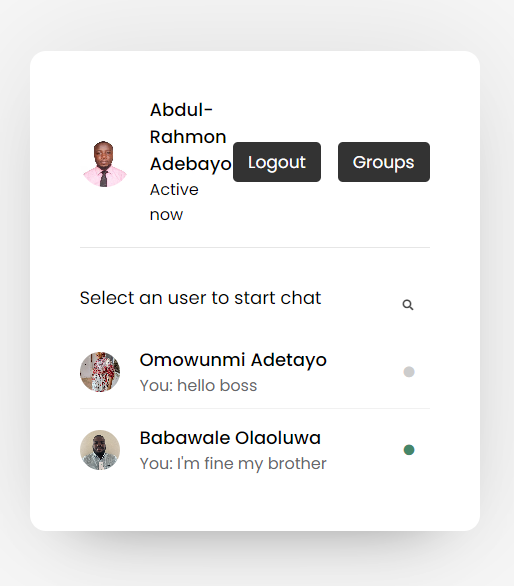
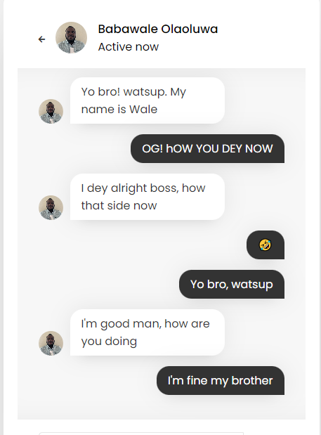

# ChatterBox Chat Application


ChatterBox is a versatile chat application that allows users to engage in both individual and group chats. It provides an easy-to-use and interactive platform for real-time communication.

## Features

- **Individual Chat:** Chat one-on-one with friends and colleagues.
- **Group Chat:** Create and participate in group conversations with multiple users.
- **User Profiles:** Personalize your profile with a photo.
- **Message History:** Access chat history to view and retrieve past conversations.
- **Online/Offline Status:** Know when users are online or offline.
- **Security:** Secure and encrypted communication.

## Getting Started

1. **Installation:**
   - Clone this repository to your local machine.

   ```bash
   git clone https://github.com/adebayo3035/ChatterBox.git
   ```

   - Install any necessary dependencies such as localhost and mysql.

   ```bash
   cd ChatterBox
   composer install # If using PHP
   ```

2. **Configuration:**
   - Configure your database settings in `config.php` (if applicable).
   - Create and import your Database Tables on localhost using PhpmyAdmin from the file chatapp.sql

3. **Run the Application:**
   - Start a local development server (e.g xampp, wampp).
   - Access the application in your web browser using the URL: localhost/ChatterBox/login.php.

4. **Usage:**
   - Create an account or log in.
   - Start chatting with friends and colleagues.

## Screenshots




## Technologies Used

- HTML, CSS, JavaScript for the frontend
- PHP for server-side scripting
- MySQL or another database system for data storage
- AJAX for real-time messaging (if applicable)

## Contributing

Contributions are welcome! Please fork this repository and create a pull request with your changes.

## License

This project is licensed under the [MIT License](LICENSE).

## Contact

For any inquiries or issues, please contact our support team at adebayoabdulrahmon@gmail.com.

---

Thank you for choosing ChatterBox for your real-time communication needs! We hope you enjoy using our chat application.